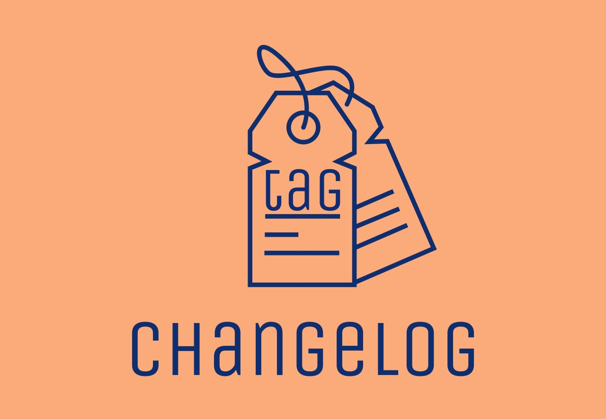

<p align="center">
  
</p>

# tag-changelog
A GitHub Action triggered by a new tag getting pushed. It then fetches all the commits since the previous tag and creates a changelog text using the [Conventional Commits](https://www.conventionalcommits.org) format. It will also turn PR numbers into clickable links.

This action returns the generated changelog text, but doesn't do anything more; you need to for example prepend it to a `CHANGELOG.md` file, create a GitHub Release with this text, etc.

## Example workflow
``` yml
name: Create Release

on:
  push:
    tags:
      - '*'

jobs:
  create-release:
    runs-on: ubuntu-latest

    steps:
      - name: Checkout
        uses: actions/checkout@v2

      - name: Create changelog text
        id: changelog
        uses: loopwerk/conventional-changelog-action@latest
        with:
          token: ${{ secrets.GITHUB_TOKEN }}
          exclude_types: other,doc,chore

      - name: Create release
        uses: actions/create-release@latest
        env:
          GITHUB_TOKEN: ${{ secrets.GITHUB_TOKEN }}
        with:
          tag_name: ${{ github.ref }}
          release_name: Release ${{ github.ref }}
          body: ${{ steps.changelog.outputs.changes }}
```

## Inputs
* `token`: Your GitHub token, `${{ secrets.GITHUB_TOKEN }}`. Required.
* `exclude_types`: A comma separated list of commit types you want to exclude from the changelog, for example: "other,chore". Optional (defaults to nothing). Can also be configured in the config file.
* `config_file`: Location of the config file. Optional.

## Outputs
* `changelog`: Generated changelog for the latest tag, including the version/date header (suitable for prepending to a CHANGELOG.md file).
* `changes`: Generated changelog for the latest tag, without the version/date header (suitable for GitHub Releases).

## Custom config
``` yml
- name: Create changelog text
  uses: loopwerk/conventional-changelog-action@latest
  with:
    token: ${{ secrets.GITHUB_TOKEN }}
    config_file: .github/tag-changelog-config.js
```

The config file can be used to map commit types to changelog labels, to override the rendering of changelog sections, and the rendering of the overall changelog. You only need to override the things you want to override. For example, you can leave out `renderTypeSection` and `renderChangelog` and only include the `types` config; the default config will be used for whatever is not overriden.

### Example config file:

``` javascript
module.exports = {
  types: [
    { types: ["feat", "feature"], label: "🎉 New Features" },
    { types: ["fix", "bugfix"], label: "🐛 Bugfixes" },
    { types: ["improvements", "enhancement"], label: "🔨 Improvements" },
    { types: ["perf"], label: "🏎️ Performance Improvements" },
    { types: ["build", "ci"], label: "🏗️ Build System" },
    { types: ["refactor"], label: "🪚 Refactors" },
    { types: ["doc", "docs"], label: "📚 Documentation Changes" },
    { types: ["test", "tests"], label: "🔍 Tests" },
    { types: ["style"], label: "💅 Code Style Changes" },
    { types: ["chore"], label: "🧹 Chores" },
    { types: ["other"], label: "Other Changes" },
  ],

  excludeTypes: ["other"],

  renderTypeSection: function (label, commits) {
    let text = `\n## ${label}\n`;

    commits.forEach((commit) => {
      text += `- ${commit.subject}\n`;
    });

    return text;
  },

  renderChangelog: function (release, changes) {
    const now = new Date();
    return `# ${release} - ${now.toISOString().substr(0, 10)}\n` + changes + "\n\n";
  },
};
```

The order in which the `types` appear also determines the order of the generated sections in the changelog.

## Example output

> # v0.14.0 - 2021-02-22
> 
> ## New Features
> - merge the default config with the user config so that the user config only has to override values it wants, and use the defaults for the others
> - the custom config file is now JS instead of JSON, allow the override of the changelog text templates ([#2](https://github.com/loopwerk/tag-changelog/pull/2) by [kevinrenskers](https://github.com/kevinrenskers))
> - commit types to exclude can now also be configured via the config file
> 
> ## Documentation Changes
> - simplified readme
> 
> ## Chores
> - added project logo
> 
> ## BREAKING CHANGES
> - due to [bcb876](https://github.com/loopwerk/tag-changelog/commit/bcb8767bc22bc7d4ab47a4fffd4ef435de581054): commit types to exclude can now also be configured via the config file
> The `exclude` input parameter has been renamed to `exclude_types`.

## Roadmap
- Display type scope
- Handle the very first tag - currently this Action only works when at least two tags are found

## Thanks
Thanks to [Helmisek/conventional-changelog-generator](https://github.com/Helmisek/conventional-changelog-generator) and [ardalanamini/auto-changelog](https://github.com/ardalanamini/auto-changelog) for inspiration. Thanks to [nektos/act](https://github.com/nektos/act) for making it possible to run GitHub Actions locally, making development and testing a whole lot easier.
